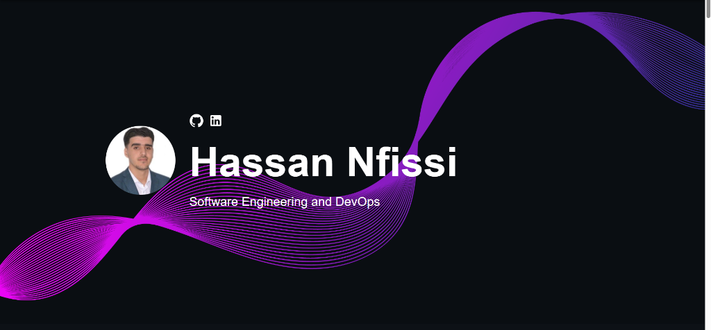

# 🌐 Hassan Nfissi — Personal Portfolio Website

[](https://Hassan-Nfissi.github.io/My-portfolio)
[](https://reactjs.org/)
[](https://www.typescriptlang.org/)
[](https://sass-lang.com/)
[](LICENSE)

A modern, responsive, interactive portfolio website built with **React** and **TypeScript**. Designed to highlight expertise in **Software Engineering**, **DevOps & Cloud Automation**, and **AI Solutions**, presenting real-world projects, professional experience, certifications, and technical skills to recruiters and engineering managers.

---

## 📸 Preview



👉 **[Experience Live Website Here](https://Hassan-Nfissi.github.io/My-portfolio)**

---

## 💡 Value Delivered for Recruiters & Engineering Teams

* **End-to-End Technical Profile:** Demonstrates full-stack development skills (React, TypeScript, Spring Boot, Python) alongside cloud & DevOps capabilities (Docker, Kubernetes, Jenkins, Terraform, Ansible, AWS, Azure, Keycloak, Vault, Grafana).
* **Featured Projects Showcase:** Quick access to real production-grade source code including **TermAI** (Wails/Go + React floating desktop assistant), **DevSecOps CI/CD Pipelines**, **AWS Terraform Infrastructure**, and **ML Player Rank Prediction**.
* **Clear Career Progression:** Chronological timeline detailing PFE & industry internships with quantifiable deliverables and technology stacks.
* **Modern UI & Responsive UX:** Clean dark-theme interface built with custom SCSS animations, Material-UI components, and smooth navigation.

---

## 🛠️ Complete Tech Stack

### **Frontend & Interface**
* **Framework & Language:** React 18 (TypeScript)
* **Styling:** SASS / SCSS, Material-UI (MUI), Custom CSS Animations
* **Components & Icons:** FontAwesome, Material Icons, Vertical Timeline Component
* **Animations:** Framer Motion

### **Featured Engineering & DevOps Stack Showcase**
* **Languages & Frameworks:** Java 21, Spring Boot, Python (FastAPI), Go, React
* **DevOps & CI/CD:** Jenkins, Docker, Docker Compose, Kubernetes, Terraform, Ansible, Git
* **Cloud & Infrastructure:** AWS (S3, CloudFront, Route53, EC2), Microsoft Azure
* **Security & Observability:** Keycloak, HashiCorp Vault, Grafana, Loki, Grafana Alloy, Prometheus

---

## 📋 Key Sections

| Section | Description |
| :--- | :--- |
| **Main Banner** | Professional title, avatar, and quick links to GitHub & LinkedIn. |
| **Expertise** | Detailed domain cards for Software Engineering, DevOps & Automation, and Cloud Platforms with tech chips. |
| **Career History** | Interactive vertical timeline highlighting professional experience (Adria Business & Technology, TICLab, NewDev). |
| **Personal Projects** | Responsive grid of key open-source projects with thumbnail previews, descriptions, and direct repo links. |
| **Certifications** | Industry certifications and domain qualifications. |
| **Contact** | Direct email contact form and social media channels. |

---

## 🚀 Local Development Setup

To run this portfolio locally on your machine:

### **1. Prerequisites**
* [Node.js](https://nodejs.org/) (v18 or higher recommended)
* `npm` (Package Manager)

### **2. Installation & Execution**
```bash
# Clone the repository
git clone https://github.com/Hassan-Nfissi/My-portfolio.git

# Navigate into the project folder
cd My-portfolio

# Install dependencies
npm install

# Start the local development server
npm start
```
Open **`http://localhost:3000`** in your browser to view the application.

### **3. Build & Deployment**
```bash
# Create an optimized production build
npm run build

# Deploy automatically to GitHub Pages
npm run deploy
```

---

## 📬 Contact & Links

* **GitHub:** [@Hassan-Nfissi](https://github.com/Hassan-Nfissi)
* **LinkedIn:** [Hassan Nfissi](https://www.linkedin.com/in/hassan-nfissi-9b784428b)
* **Live Portfolio:** [Hassan Nfissi Portfolio](https://Hassan-Nfissi.github.io/My-portfolio)
